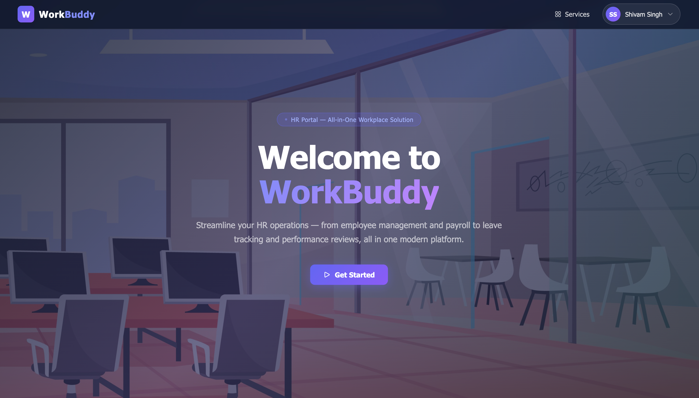
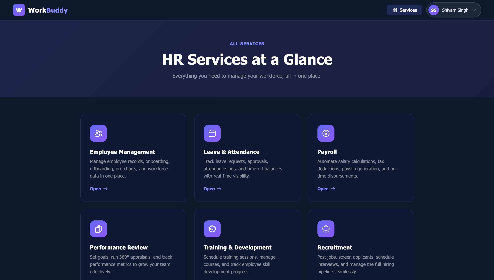
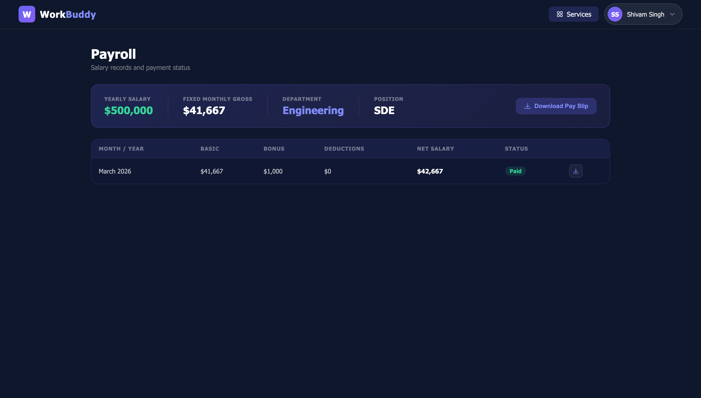

# WorkBuddy

> **One platform. Every HR operation. Zero cost.**

---

## The Problem Every Small Business Owner Knows

You're running a team. HR is happening — but it's scattered:

- Leave requests come in over **WhatsApp**
- Salaries are tracked in a **personal Excel sheet**
- Performance reviews live in **email threads**
- Payslips are printed and handed out **manually, every month**
- Nobody knows who's on leave, who's been paid, or who needs training

**You don't have an HR problem. You have an HR chaos problem.**

And the tools that solve it — BambooHR, SAP, Zoho People — cost thousands per year, require IT setup, and are built for companies 10x your size.

---

## Introducing WorkBuddy

**WorkBuddy is a free, professional HR management portal built specifically for small businesses.**

No subscription. No database. No IT team. No credit card. Just sign in and run your team like a pro.

> Live demo: [workbuddy.app](https://shivamsinghss.github.io/WorkBuddy/src/main/resources/static/index.html)

---

## What It Looks Like

### Landing Page — Clean, Professional, Instant Access

> 

---

### Services Dashboard — Everything in One Place

>

---

## The 6 Modules That Run Your HR

---

### 1. Employee Management

Add employees, set roles, manage profiles — all in one table. Every employee you add gets their own login automatically.

**Admin view:** Full CRUD — add, edit, deactivate
**Employee view:** Read-only access to their own profile

> 
---

### 2. Leave & Attendance

Employees apply for **Leave, WFH, or Comp Off** in one click. Admins approve or reject. Leave credits are automatically adjusted.

Built-in **Punch In / Punch Out** tracking with timestamps. Today's status card locks once submitted — no editing, no disputes.

>
### 3. Payroll

Set yearly salary once. Monthly gross is calculated automatically. Add bonus and deductions per record. Mark as Paid when processed.

Employees can **download their own pay slip** — by month or full year — as a printable PDF, without ever contacting HR.

> 

---

### 4. Performance Reviews

Create review records per employee per cycle. Track ratings and feedback. Employees see their own history — no awkward conversations about "what did you say last quarter?"

> **Screenshot placeholder**
> _Add screenshot of `performance.html`_
> Suggested filename: `screenshots/06-performance.png`

---

### 5. Training Management

Log training programs, assign them to employees, track completion. Foundation for automated onboarding and compliance training (coming soon).

> **Screenshot placeholder**
> _Add screenshot of `training.html`_
> Suggested filename: `screenshots/07-training.png`

---

### 6. Recruitment

Post open roles with department and description. Track each position from open to filled. Keeps hiring organized without a dedicated recruiter.

> **Screenshot placeholder**
> _Add screenshot of `recruitment.html`_
> Suggested filename: `screenshots/08-recruitment.png`

---

## Two Roles. One Platform.

| | Admin (You / HR Manager) | Employee |
|---|---|---|
| Employees | Add, edit, deactivate | View own profile |
| Leave | View + approve/reject all | Apply, track own requests |
| Payroll | Create, edit, mark paid | View + download own payslips |
| Performance | Create + manage reviews | View own reviews |
| Training | Assign + track all | View own assignments |
| Recruitment | Post + manage openings | Browse openings |

---

## Why It Works Without a Database

WorkBuddy stores all data in **Excel files on your own machine or server**.

- No database to install or maintain
- Files are human-readable — open them in Excel anytime
- Your data never leaves your control
- Back up your entire company's HR history by copying a folder
- When you outgrow Excel, swap to PostgreSQL — zero changes to business logic

---

## How It Compares

| | WorkBuddy | BambooHR | Zoho People | SAP |
|---|---|---|---|---|
| **Price** | Free | $6–9/user/mo | $1–3/user/mo | Enterprise pricing |
| **Setup time** | < 5 minutes | Hours–Days | Hours–Days | Weeks–Months |
| **Self-hosted** | Yes | No | No | No |
| **Your data** | On your machine | Their server | Their server | Their server |
| **Pay slip download** | Yes | Yes | Yes | Yes |
| **Open source** | Yes | No | No | No |

---

## Who This Is Built For

| You Are | Your Problem Today | WorkBuddy Fixes It By |
|---|---|---|
| **Startup founder** | Managing HR alongside product work | One portal, 5-min setup, runs locally |
| **HR manager** | Manually generating payslips every month | Employees download their own slips |
| **Team lead** | No visibility on leave and attendance | Real-time status board for your team |
| **Finance owner** | Salary records in multiple spreadsheets | Single payroll module, auto net salary |

---

## What's Coming Next

### Scheduler Engine — HR on Autopilot

The next version of WorkBuddy adds an automation layer. Set it once, and it runs:

- **Payroll auto-generation** — salary records created on the 1st of every month for all active employees
- **Annual leave reset** — leave balances restored every January 1st automatically
- **Onboarding training** — assigned the moment a new employee is added
- **Review cycle initiation** — quarterly or annual review records created on schedule
- **Recruitment aging alerts** — notifies hiring managers when a role has been open too long

> No more "I forgot to run payroll." No more "who still hasn't done their compliance training?"

---

## The Numbers

| Metric | Reality |
|---|---|
| HR admin time saved | **4–6 hours/week** for a 10-person team |
| Cost vs. BambooHR (10 employees) | **$0 vs. ~$720/year** |
| Setup time | **Under 5 minutes** |
| Modules covered | **6 core HR functions** |
| Database required | **None** |

---

## Get Started in 3 Steps

1. Visit the live portal: [WorkBuddy](https://shivamsinghss.github.io/WorkBuddy/src/main/resources/static/index.html)
2. Sign in as admin and explore
3. Add your first employee — they get their own login instantly

> **Note:** The backend runs on a free server instance. The first request may take up to **50 seconds** to wake up. This is a cold-start delay on free hosting — it does not happen on a paid or self-hosted instance.

---

## For Developers & Technical Buyers

- **Backend:** Spring Boot 4 · Java 17
- **Storage:** Apache POI 5.3.0 (Excel as database)
- **Frontend:** HTML5 · CSS3 · Vanilla JS — no framework dependency
- **API:** RESTful JSON
- **Auth:** Role-based (Admin / Employee) · session via localStorage
- **Build:** Gradle
- **Scheduler (roadmap):** Spring `@Scheduled` · Quartz

Self-host on any machine that runs Java. No cloud account required.

---

## In Summary

WorkBuddy gives your small business the **same HR infrastructure as a 500-person company** — at zero cost, with zero setup, and with your data staying on your own machine.

It is not another SaaS subscription. It is not a spreadsheet. It is a **professional HR system that works from day one**.

---

> **WorkBuddy** — Built with Spring Boot 4 · Apache POI · Java 17
>
> Open source. Self-hosted. Zero dependency.
>
> [Live Demo](https://shivamsinghss.github.io/WorkBuddy/src/main/resources/static/index.html)

---

## Adding Screenshots

To replace the screenshot placeholders above:

1. Run the app locally or open the live demo
2. Take screenshots of each page at ~1400px wide for best quality
3. Save them to a `screenshots/` folder in the project root
4. Replace each placeholder block with: ``

Suggested shots to capture:
- `01-landing.png` — Hero section of index.html
- `02-services-dashboard.png` — Services grid (logged in)
- `03-employees.png` — Employee table (admin view)
- `04-leaves.png` — Leave requests + today's status card
- `05-payroll.png` — Payroll table with salary breakdown
- `06-performance.png` — Performance review table
- `07-training.png` — Training assignments
- `08-recruitment.png` — Job postings board
